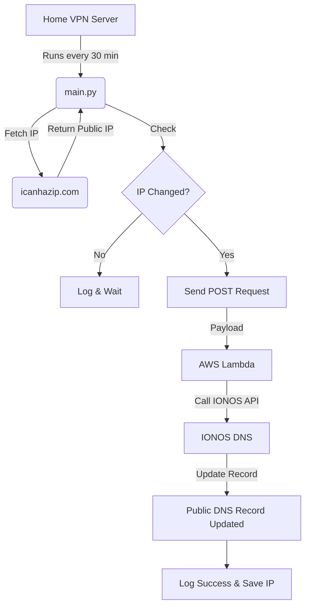

# Home VPN IP Auto Rotation

This project automatically detects your public IP address and updates your domain's DNS records when the IP changes. It is designed for users who want to maintain a dynamic VPN endpoint (like OpenVPN or WireGuard) pointing to a home server with a dynamic IP.

## Overview

The system consists of two main parts:
1.  **Local Script (`main.py`)**: Runs periodically (or as a cron job) on your home server. It checks your current public IP, compares it with the last known IP, and sends a request to a Lambda function if a change is detected.
2.  **AWS Lambda Function (`lambdafunction.py`)**: Receives the update request and uses the IONOS DNS API to update the `A` record of your specified subdomain.




-   **Automatic IP Detection**: Uses `icanhazip.com` to fetch the current public IP.
-   **State Management**: Persists the last known IP in a local JSON file to avoid unnecessary updates.
-   **Cloud Integration**: Leverages AWS Lambda and IONOS DNS for seamless record updates.
-   **Logging**: Detailed logging for debugging and monitoring.

## Prerequisites

-   **Python 3.x** installed on your local machine.
-   **AWS Account** to host the Lambda function.
-   **IONOS Account** with DNS access.
-   `requests` and `urllib3` Python libraries.

## Environment Variables

The following environment variables must be configured:

| Variable | Description | Location |
| :--- | :--- | :--- |
| `CUSTOMDDNS_SVC` | The URL of the AWS Lambda function | Local (Home Server) |
| `API_KEY` | Your IONOS API Key | Local (Home Server) |
| `ZONEID` | Your IONOS DNS Zone ID | AWS Lambda |
| `RECORDID` | Your IONOS DNS Record ID | AWS Lambda |
| `lambda_api_key` | A custom secret key for the Lambda function | AWS Lambda |

## Setup & Usage

1.  **Configure Environment Variables**: Set the required environment variables on your local machine and in your AWS Lambda configuration.
2.  **Deploy Lambda**: Deploy the code in `lambdafunction.py` to AWS Lambda.
3.  **Run the script**: Execute the local script:
    ```bash
    python main.py
    ```
4.  **Automation**: Schedule `main.py` to run every 30 minutes on your home Linux VPN machine:
    - Run `crontab -e` to edit your cron jobs.
    - Add the following line (replace the path with your actual path):
      ```bash
      */30 * * * * /usr/bin/python3 <my-local-file>/customddns/main.py
      ```

## File Structure

-   `main.py`: The main script that monitors the public IP and triggers updates.
-   `lambdafunction.py`: The AWS Lambda function code for updating DNS records.
-   `current_ip.json`: (Generated) Stores the last recorded public IP.
-   `logs/`: Directory where log files are stored.

## License

Free to use
